# **Variabilidade Espaço-Temporal do CO<sub>2</sub> atmosférico no sudeste do Brasil: uma perspectiva com sensoriamento remoto**

**Luis M. Costa**

## **Introdução**

Neste repositorio você irá encontrar os dados relacionados ao
desenvolvimento do meu Trabalho de conclusão de curso (TCC). Esta
pesquisa foi financiada pela FAPESP (n°: 2019/25812-4).

O objetivo principal deste trabalho foi analisar a variabilidade
espaço-temporal da concentração de CO<sub>2</sub> atmosférica no sudeste
do Brasil e identificar seus máximos e mínimos ao longo dos anos bem
como suas relações com índices vegetativos e climáticos.

Desta forma, na pasta `data-raw/` você irá encontrar os diversos bancos
de dados utilizados para as analises. Na pasta `R/` você pode encontrar
algumas funções criadas para realizar algumas analises. Por fim na pasta
`data/`, você irá encontrar a saida de dados para a geoestatistica (está
foi realizada no *software* GS+)

## **Carregando dados e funções**

Aqui iremos carregar os dados e algumas funções que iremos utilizar
durante as analises

``` r
source('R/func.R') #script com as funções criadas

xco2_or <- read.csv('data-raw/xco2.csv') |> 
  dplyr::mutate(
    xco2_est= 400 + 0.00013*X,
    delta = xco2_est-xco2,
    xco2_adj=(400-delta)-(mean(xco2)-400), # retirada da tendencia de aumento monotonica
    mes=lubridate::month(date),
    ano=lubridate::year(date)
    )

sif_or <- read.csv('data-raw/sif.csv') |> 
  dplyr::filter(sif_757>0) |> 
  dplyr::mutate(
    date=lubridate::as_datetime(time,origin='1990-01-01 00:00:00'),
    date=lubridate::as_date(date),
    ano=lubridate::year(date),
    mes=lubridate::month(date)
  ) 

gpp_or <- read.csv('data-raw/gpp.csv')
ndvi_or <- read.csv('data-raw/ndvi.csv') 
lai_or <- read.csv('data-raw/lai.csv')
lst_or <-   read.csv('data-raw/lst.csv')
power_or <-  read.csv('data-raw/power.csv')
```

## **Estatisticas**

### **Descritiva**

``` r
tab_est <- xco2_or |> 
  dplyr::select(xco2, xco2_adj) |> 
  apply(2,est_descritiva) |> 
  as.data.frame()

sif_est <- sif_or |> 
  dplyr::select(sif_757)|>
  apply(2,est_descritiva) |> 
  as.data.frame()

gpp_es <- gpp_or |> 
  dplyr::mutate(
    GPP=MOD17A2H_006_Gpp_500m
  ) |> 
  dplyr::select(GPP) |> 
  apply(2,est_descritiva) |> 
  as.data.frame()

ndvi_es <- ndvi_or |> 
  dplyr::mutate(
    ndvi=MOD13A1_006__500m_16_days_NDVI
  ) |> 
  dplyr::select(ndvi) |> 
  apply(2,est_descritiva) |> 
  as.data.frame()


lai_es <- lai_or |>
  dplyr::mutate(
    lai=MCD15A2H_006_Lai_500m
  ) |> 
  dplyr::select(lai) |> 
  apply(2,est_descritiva) |> 
  as.data.frame()

lst_est <- lst_or |> 
  dplyr::mutate(
    LST = MOD11A2_006_LST_Day_1km - 273.15
  ) |> 
  dplyr::select(LST) |> 
  apply(2,est_descritiva) |> 
  as.data.frame()

power_es <- power_or |> 
  dplyr::mutate(
    Qg = ALLSKY_SFC_SW_DWN,
    Prec = PRECTOTCORR,
    Temp=T2M,
    RH=RH2M
  ) |> 
  dplyr::select(Qg,Prec,Temp,RH) |> 
  apply(2,est_descritiva) |> 
  as.data.frame()

tab_est <- cbind(tab_est,sif_est,gpp_es,ndvi_es,lai_es,lst_est,power_es)

write.csv(tab_est, 'data/estatistica_descr.csv')

rm(tab_est,sif_est,lst_est,gpp_es,lai_es,power_es,ndvi_es) # removendo do ambiente
```

**Tabela de médias**

``` r
xco2_m <- xco2_or |> 
  dplyr::group_by(ano,mes) |> 
  dplyr::summarise(
    xco2_obs=mean(xco2),
    xco2_sd=sd(xco2),
    xco2_est=mean(xco2_adj),
    xco2_adj_sd=sd(xco2_adj)
  )

sif_m <- sif_or |> 
  dplyr::group_by(ano,mes) |> 
  dplyr::summarise(
    SIF_757=mean(sif_757),
    SIF_757sd=sd(sif_757)
  )

gpp_m <- gpp_or |> 
  dplyr::mutate(
    ano=lubridate::year(Date),
    mes=lubridate::month(Date)
  ) |> 
  dplyr::group_by(ano,mes) |> 
  dplyr::summarise(
    GPP=sum(MOD17A2H_006_Gpp_500m)
  )

ndvi_m <- ndvi_or |> 
  dplyr::mutate(
    ano=lubridate::year(Date),
    mes=lubridate::month(Date)
  ) |> 
  dplyr::group_by(ano,mes) |> 
  dplyr::summarise(
    NDVI=mean(MOD13A1_006__500m_16_days_NDVI),
    ndvi_sd =sd(MOD13A1_006__500m_16_days_NDVI) 
  )

lai_m <- lai_or |> 
  dplyr::mutate(
    ano=lubridate::year(Date),
    mes=lubridate::month(Date)
  ) |> 
  dplyr::group_by(ano,mes) |> 
  dplyr::summarise(
    LAI= mean(MCD15A2H_006_Lai_500m),
    lai_sd = sd(MCD15A2H_006_Lai_500m)
  )

lst_m <-  lst_or |> 
  dplyr::mutate(
    ano=lubridate::year(Date),
    mes=lubridate::month(Date),
    lst = MOD11A2_006_LST_Day_1km-273.15
  ) |> 
  dplyr::group_by(ano,mes) |> 
  dplyr::summarise(
    LST = mean(lst),
    lst_sd = sd(lst)
  )

power_m <-power_or |> 
  dplyr::mutate(
    ano=lubridate::year(YYYYMMDD),
    mes=lubridate::month(YYYYMMDD)
  ) |> 
  dplyr::group_by(lon,lat,ano,mes) |>
  dplyr::summarise(
    Qg = mean(ALLSKY_SFC_SW_DWN),
    Qg_sd = sd(ALLSKY_SFC_SW_DWN),
    Prec = sum(PRECTOTCORR),
    Temp=mean(T2M),
    temp_sd = sd(T2M),
    RH=mean(RH2M),
    RH_sd = sd(RH2M)
  ) |> 
  dplyr::group_by(ano,mes) |> 
  dplyr::summarise(
    Qg = mean(Qg),
    Qg_sd = mean(Qg_sd),
    Prec = mean(Prec),
    Temp=mean(Temp),
    temp_sd = mean(temp_sd),
    RH=mean(RH),
    RH_sd = mean(RH_sd))


tab_me <-xco2_m |> 
  dplyr::mutate(
    XCO2=xco2_obs,
    XCO2adj=xco2_est
  ) |> 
  dplyr::select(ano,mes,XCO2, xco2_sd,XCO2adj, xco2_adj_sd) |> 
  dplyr::left_join(sif_m ) |> 
  dplyr::left_join(gpp_m ) |> 
  dplyr::left_join(ndvi_m) |> 
  dplyr::left_join(lai_m) |> 
  dplyr::left_join(lst_m) |> 
  dplyr::left_join(power_m) |> 
  dplyr::filter(ano>2014 & ano < 2022)

write.csv(tab_me,'data/médias_desv.csv')
```

## **Correlação**

``` r
tab <- xco2_m |> 
  dplyr::mutate(
    XCO2=xco2_obs,
    XCO2adj=xco2_est
  ) |> 
  dplyr::select(ano,mes,XCO2,XCO2adj) |> 
  dplyr::left_join(sif_m |> dplyr::select(ano,mes,SIF_757)) |> 
  dplyr::left_join(gpp_m |> dplyr::select(ano,mes,GPP)) |> 
  dplyr::left_join(ndvi_m |> dplyr::select(ano,mes,NDVI)) |> 
  dplyr::left_join(lai_m |> dplyr::select(ano,mes,LAI)) |> 
  dplyr::left_join(lst_m |> dplyr::select(ano,mes,LST)) |> 
  dplyr::left_join(power_m |> dplyr::select(ano,mes,Prec,Temp,RH,Qg)) |> 
  dplyr::filter(ano>2014 & ano < 2022) |>
  na.omit()
```

``` r
tab|> 
  GGally::ggpairs(columns = 3:13)
```

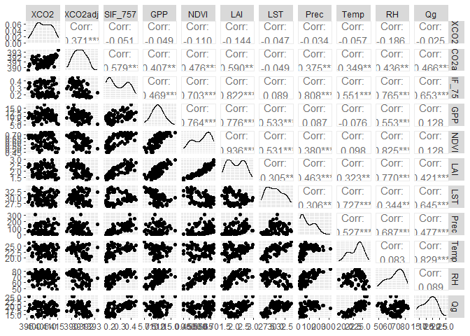<!-- -->

## **Analise Temporal**

``` r
xco2_m |> 
  dplyr::filter(ano>2014 & ano < 2022) |> 
  dplyr::mutate(
    date= lubridate::as_date(stringr::str_c(
      ano,mes,'1',sep = '-'
    )) 
  ) |> 
  ggplot2::ggplot(ggplot2::aes(x=date, y=xco2_obs, 
                               ymax=xco2_obs+xco2_sd,
                               ymin=xco2_obs-xco2_sd))+
  ggplot2::geom_point(color='dark red')+
  ggplot2::geom_line(color='dark red')+
  ggplot2::theme_bw()+
  ggplot2::xlab('Date')+
  ggplot2::ylab(expression(
    'Xco'[2]~' (ppm)'
  ))+
  ggplot2::theme(
    axis.text = ggplot2::element_text(size=12, color='black'),
    axis.ticks = ggplot2::element_line(size,color='black')
  )
```

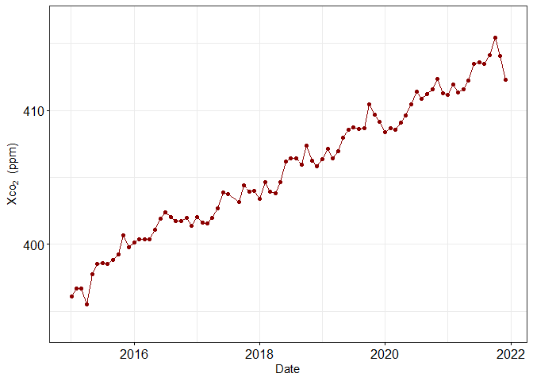<!-- -->

``` r
xco2_m |> 
  dplyr::filter(ano>2014 & ano < 2022) |> 
  dplyr::mutate(
    date= lubridate::as_date(stringr::str_c(
      ano,mes,'1',sep = '-'
    )) 
  ) |> 
  ggplot2::ggplot(ggplot2::aes(x=date, y=xco2_est))+
  ggplot2::geom_point(color='dark red')+
  ggplot2::geom_line(color='dark red')+
  ggplot2::theme_bw()+
  ggplot2::xlab('Date')+
  ggplot2::ylab(expression(
    'Xco'[2]~' (ppm)'
  ))+
  ggplot2::theme(
    axis.text = ggplot2::element_text(size=12, color='black'),
    axis.ticks = ggplot2::element_line(size,color='black')
  )
```

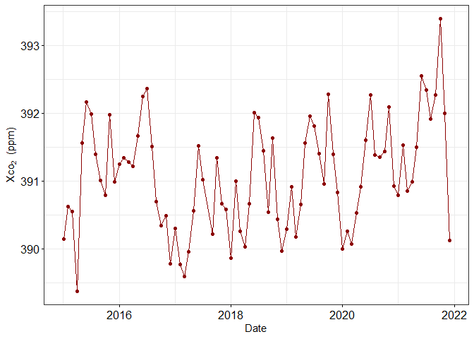<!-- -->

``` r
sif_m |> 
  dplyr::filter(ano>2014 & ano < 2022) |> 
  dplyr::mutate(
    date= lubridate::as_date(stringr::str_c(
      ano,mes,'1',sep = '-'
    )) 
  ) |> 
  ggplot2::ggplot(ggplot2::aes(x=date, y=SIF_757))+
  ggplot2::geom_point(color='dark green')+
  ggplot2::geom_line(color='dark green')+
  ggplot2::theme_bw()+
  ggplot2::xlab('Date')+
  ggplot2::ylab(expression(
    'SIF 757nm (Wm'^-2~'sr'^-1~mu~'m'^-1~')'
  ))+
  ggplot2::theme(
    axis.text = ggplot2::element_text(size=12,color='black'),
    axis.ticks = ggplot2::element_line(color='black')
  )
```

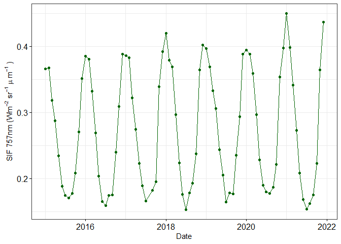<!-- -->

``` r
gpp_m |> 
  dplyr::filter(ano>2014 & ano < 2022) |> 
  dplyr::mutate(
    date= lubridate::as_date(stringr::str_c(
      ano,mes,'1',sep = '-'
    )) 
  )  |> 
  ggplot2::ggplot(ggplot2::aes(x=date, y=GPP))+
  ggplot2::geom_point(color='dark green')+
  ggplot2::geom_line(color='dark green')+
  ggplot2::theme_bw()+
  ggplot2::xlab('Date')+
  ggplot2::ylab(expression(
    'GPP (kg C '~m^-2~')'
  ))+
  ggplot2::theme(
    axis.text = ggplot2::element_text(size=12,color='black'),
    axis.ticks = ggplot2::element_line(color='black')
  )
```

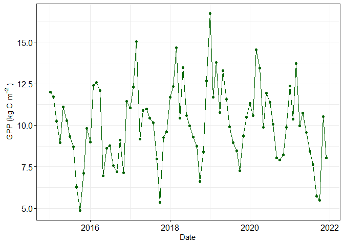<!-- -->

``` r
power_m |> 
  dplyr::filter(ano>2014 & ano < 2022) |> 
  dplyr::mutate(
    date= lubridate::as_date(stringr::str_c(
      ano,mes,'1',sep = '-'
    )) 
  )  |> 
  ggplot2::ggplot(ggplot2::aes(x=date, y=Qg))+
  ggplot2::geom_point(color='dark orange')+
  ggplot2::geom_line(color='dark orange')+
  ggplot2::theme_bw()+
  ggplot2::xlab('Date')+
  ggplot2::ylab(expression(
    'Qg (MJ m'^-2~'dia'^-1~')'
  ))+
  ggplot2::theme(
    axis.text = ggplot2::element_text(size=12,color='black'),
    axis.ticks = ggplot2::element_line(color='black')
  )
```

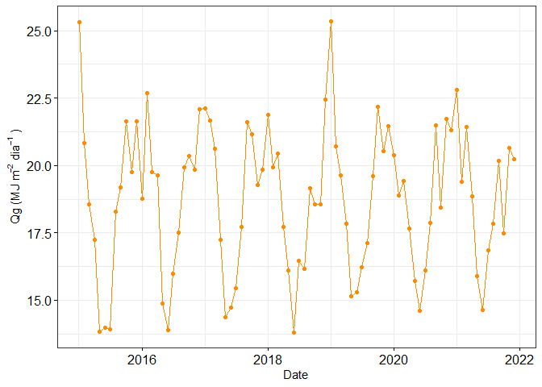<!-- -->

``` r
power_m |> 
  dplyr::filter(ano>2014 & ano < 2022) |> 
  dplyr::mutate(
    date= lubridate::as_date(stringr::str_c(
      ano,mes,'1',sep = '-'
    )) 
  )  |> 
  ggplot2::ggplot(ggplot2::aes(x=date, y=Prec))+
  ggplot2::geom_point(color='dark blue')+
  ggplot2::geom_line(color='dark blue')+
  ggplot2::theme_bw()+
  ggplot2::xlab('Date')+
  ggplot2::ylab(expression(
    'Precipitação (mm)'
  ))+
  ggplot2::theme(
    axis.text = ggplot2::element_text(size=12,color='black'),
    axis.ticks = ggplot2::element_line(color='black')
  )
```

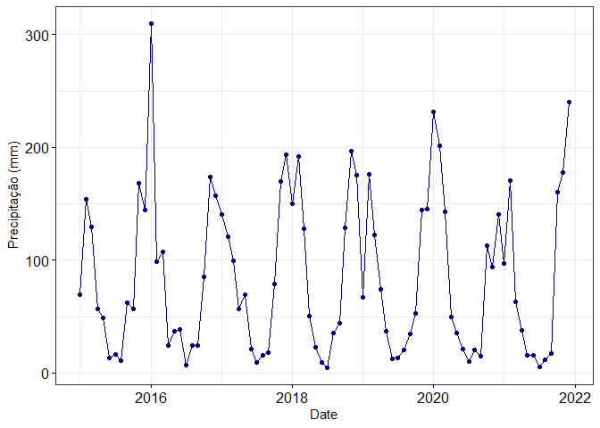<!-- -->

## **Regressões Lineares Simples**

``` r
tab |> 
  ggplot2::ggplot(ggplot2::aes(x=SIF_757,y=XCO2adj))+
  ggplot2::geom_point()+
  ggplot2::geom_smooth(method = 'lm')+
  ggpubr::stat_regline_equation(ggplot2::aes(
    label =  paste(..eq.label.., ..rr.label.., sep = "*plain(\",\")~~"))) +
  ggplot2::theme_bw()+
  ggplot2::theme(
    axis.text = ggplot2::element_text(color='black'),
    axis.ticks = ggplot2::element_line(color='black')
  )+
  ggplot2::ylab(expression(
    'Xco'[2]~' adj (ppm)'
  ))+
  ggplot2::xlab(expression(
    'SIF 757nm (Wm'^-2~'sr'^-1~mu~'m'^-1~')'
  ))
```

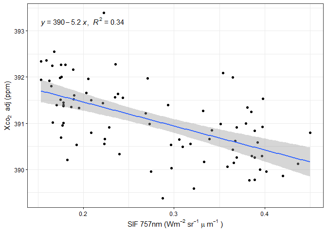<!-- -->

``` r
tab |> 
  ggplot2::ggplot(ggplot2::aes(x=GPP,y=XCO2adj))+
  ggplot2::geom_point()+
  ggplot2::geom_smooth(method = 'lm')+
  ggpubr::stat_regline_equation(ggplot2::aes(
    label =  paste(..eq.label.., ..rr.label.., sep = "*plain(\",\")~~"))) +
  ggplot2::theme_bw()+
  ggplot2::theme(
    axis.text = ggplot2::element_text(color='black'),
    axis.ticks = ggplot2::element_line(color='black')
  )+
  ggplot2::xlab(expression('GPP ( g C m'^-2~'month'^-1~')'))+
  ggplot2::ylab(expression(
    'Xco'[2]~' adj (ppm)'
  ))
```

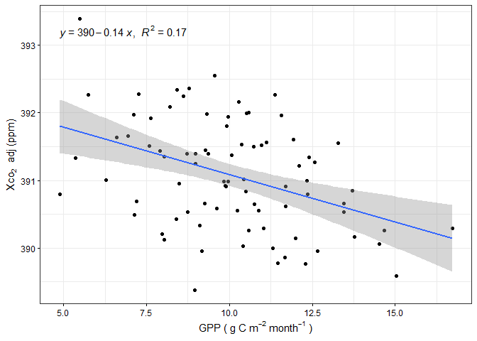<!-- -->

``` r
tab |> 
  ggplot2::ggplot(ggplot2::aes(x=SIF_757,y=GPP))+
  ggplot2::geom_point()+
  ggplot2::geom_smooth(method = 'lm')+
  ggpubr::stat_regline_equation(ggplot2::aes(
    label =  paste(..eq.label.., ..rr.label.., sep = "*plain(\",\")~~"))) +
  ggplot2::theme(
    axis.text = ggplot2::element_text(color='black')
  )+
  ggplot2::theme_bw()+
  ggplot2::theme(
    axis.text = ggplot2::element_text(color='black'),
    axis.ticks = ggplot2::element_line(color='black')
  )+
  ggplot2::ylab(expression('GPP ( g C m'^-2~'month'^-1~')'))+
  ggplot2::xlab(expression(
    'SIF 757nm (Wm'^-2~'sr'^-1~mu~'m'^-1~')'
  ))
```

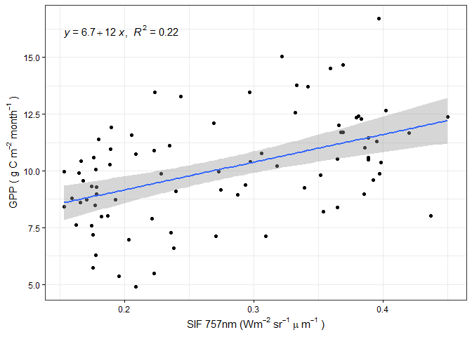<!-- -->

``` r
tab |> 
  ggplot2::ggplot(ggplot2::aes(y=SIF_757,x=Prec))+
  ggplot2::geom_point()+
  ggplot2::geom_smooth(method = 'lm')+
  ggpubr::stat_regline_equation(ggplot2::aes(
    label =  paste(..eq.label.., ..rr.label.., sep = "*plain(\",\")~~"))) +
  ggplot2::theme_bw()+
  ggplot2::theme(
    axis.text = ggplot2::element_text(color='black'),
    axis.ticks = ggplot2::element_line(color='black')
  )+
  ggplot2::xlab(expression('Prec (mm month'^-1~')'))+
  ggplot2::ylab(expression(
    'SIF 757nm (Wm'^-2~'sr'^-1~mu~'m'^-1~')'
  ))
```

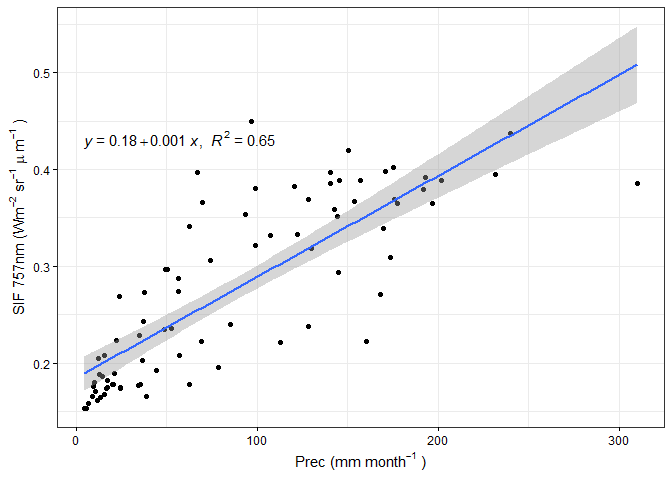<!-- -->

## **Modelagem**

``` r
tabmod <- xco2_m |> 
  dplyr::mutate(
    XCO2=xco2_obs,
    XCO2adj=xco2_est
  ) |> 
  dplyr::select(ano,mes,XCO2,XCO2adj) |> 
  dplyr::left_join(sif_m |> dplyr::select(ano,mes,SIF_757)) |> 
  dplyr::left_join(gpp_m |> dplyr::select(ano,mes,GPP)) |> 
  dplyr::left_join(ndvi_m |> dplyr::select(ano,mes,NDVI)) |> 
  dplyr::left_join(lai_m |> dplyr::select(ano,mes,LAI)) |> 
  dplyr::left_join(lst_m |> dplyr::select(ano,mes,LST)) |> 
  dplyr::left_join(power_m |> dplyr::select(ano,mes,Prec,Temp,RH,Qg)) |>
  na.omit() |> 
  dplyr::ungroup() |> 
  dplyr::select(XCO2adj,SIF_757,GPP,NDVI,LAI,LST,Prec,Temp,RH,Qg)
```

### **Stepwise**

Pré Processamento

``` r
tabstep <- tabmod
tabstep[,-1] <- tabstep[,-1] |>
  dplyr::mutate_all(scale) # padronizando os dados

set.seed(138)


inTraining <- caret::createDataPartition(tabstep$XCO2adj, p= .7, list=FALSE)
training_step <-tabmod[inTraining,] # amostra treino para Stepwise
testing_step <- tabmod[-inTraining,] #amostra teste p/ Stepwise
```

``` r
# Treinando o modelo
set.seed(138)
fitControl <- caret::trainControl(method = "repeatedcv", 
                                  number=5,
                                  repeats = 5) # otimização por validação cruzada

stepfit1 <- caret::train(XCO2adj~., data=training_step,
                         method='leapForward',
                         tuneGrid=data.frame(nvmax=1:9),
                         trControl=fitControl
)
```

``` r
# observando a perfomance

stepfit1 |>
  ggplot()+
  ggplot2::theme_bw()+
  ggplot2::theme(axis.title= ggplot2::element_text(size=14),
                 axis.text = ggplot2::element_text(size=12,color='black'),
                 legend.text = ggplot2::element_text(size=12)
  )
```

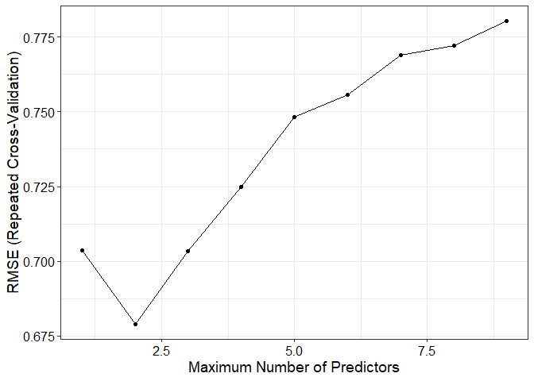<!-- -->

``` r
# observando os coef ajustados
coef(stepfit1$finalModel,2)
```

    ## (Intercept)         LAI         LST 
    ## 396.9227068  -1.2707681  -0.1072875

``` r
summary(lm(XCO2adj~LAI + LST, data = training_step))
```

    ## 
    ## Call:
    ## lm(formula = XCO2adj ~ LAI + LST, data = training_step)
    ## 
    ## Residuals:
    ##      Min       1Q   Median       3Q      Max 
    ## -1.48534 -0.36895  0.01826  0.32594  1.78878 
    ## 
    ## Coefficients:
    ##              Estimate Std. Error t value Pr(>|t|)    
    ## (Intercept) 396.92271    1.36587 290.600  < 2e-16 ***
    ## LAI          -1.27077    0.20282  -6.266 4.95e-08 ***
    ## LST          -0.10729    0.03944  -2.720   0.0086 ** 
    ## ---
    ## Signif. codes:  0 '***' 0.001 '**' 0.01 '*' 0.05 '.' 0.1 ' ' 1
    ## 
    ## Residual standard error: 0.6394 on 58 degrees of freedom
    ## Multiple R-squared:  0.4081, Adjusted R-squared:  0.3877 
    ## F-statistic:    20 on 2 and 58 DF,  p-value: 2.482e-07

``` r
# fazendo predições

stepPred <- predict(stepfit1, newdata = testing_step)
xco2_obs=testing_step$XCO2adj
xco2_est=stepPred

cv_step <- data.frame(obs=xco2_obs,est=xco2_est)

rmse_step <- Metrics::rmse(cv_step$obs,cv_step$est)
mape_step <- Metrics::mape(cv_step$obs,cv_step$est)*100

cv_step |> ggplot2::ggplot(ggplot2::aes(x=obs,y=est))+
  ggplot2::geom_point()+
  ggplot2::geom_smooth(method = "lm")+
  ggpubr::stat_regline_equation(ggplot2::aes(
    label =  paste(..eq.label.., ..rr.label.., sep = "*plain(\",\")~~")),size=4)+
  ggplot2::annotate('text',x=390.6,y=391.6,label=paste0('RMSE = ',round(rmse_step,4),', MAPE = '
                                                        ,round(mape_step,4),'%'),size=4)+
  ggplot2::labs(x=expression(paste('Xco'[2][' obs']~'ppm')),
                y=expression(paste('Xco'[2][' est']~'ppm')))+
  ggplot2::theme_bw()+
  ggplot2::theme(axis.title= ggplot2::element_text(size=12),
                 axis.text = ggplot2::element_text(size=12,color='black'),
                 legend.text = ggplot2::element_text(size=12)
  )
```

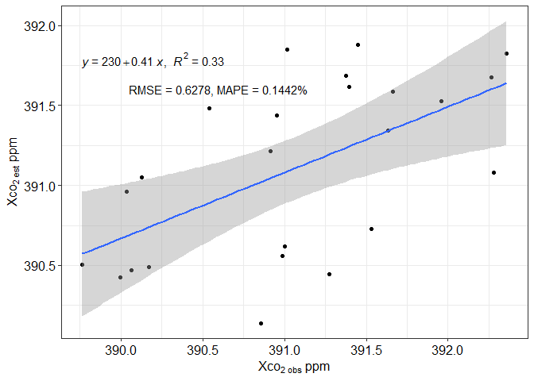<!-- -->

### **Random Forest**

pré processamento

``` r
set.seed(138)

rf_initial_split <- rsample::initial_split(tabmod, prop=.7)
testing <- rsample::testing(rf_initial_split)
training <- rsample::training(rf_initial_split)
```

``` r
rf_rasample <- rsample::vfold_cv(training,v=5)

rf_recipe <- recipes::recipe(XCO2adj~., data=training) |> 
  recipes::step_string2factor(recipes::all_nominal(),skip = TRUE) |> 
  recipes::step_normalize(recipes::all_numeric_predictors()) |> 
  recipes::step_novel(recipes::all_nominal_predictors()) |> 
  recipes::step_zv(recipes::all_predictors()) |> 
  recipes::step_dummy(recipes::all_nominal_predictors())

recipes::bake(recipes::prep(rf_recipe),new_data=NULL)
```

    ## # A tibble: 59 × 10
    ##    SIF_757    GPP    NDVI    LAI    LST    Prec   Temp      RH     Qg XCO2adj
    ##      <dbl>  <dbl>   <dbl>  <dbl>  <dbl>   <dbl>  <dbl>   <dbl>  <dbl>   <dbl>
    ##  1  0.770   1.66   1.38    2.09  -0.476 -0.373   0.729  0.163   1.09     391.
    ##  2 -0.0298 -1.22  -0.773  -0.709  1.74   1.10    1.32   0.229   0.450    392.
    ##  3  1.24    1.04   0.615   1.22  -0.109  0.440   0.396  0.987   1.19     390.
    ##  4 -0.0522  0.955  0.579   0.561 -0.280 -0.915   0.547 -0.204   0.405    391.
    ##  5 -0.381  -0.353 -1.08   -0.651  1.51  -0.0591  0.815 -0.663   0.677    390.
    ##  6  0.967   2.02   1.26    1.48  -0.520  0.748  -0.150  1.40    0.323    390.
    ##  7 -1.10    0.292  0.0779 -0.581 -1.27  -1.12   -1.25  -0.217  -1.86     392.
    ##  8 -1.08   -1.59  -1.24   -1.12   1.56  -0.377   1.08  -1.73    0.224    391.
    ##  9 -0.952   0.463 -0.161  -0.507 -1.17  -0.956  -1.61  -0.0572 -1.50     392.
    ## 10  1.30    0.259  0.718   0.711  0.544  0.787   0.767  0.649   1.11     391.
    ## # … with 49 more rows

``` r
rf_model <- parsnip::rand_forest(
  min_n = parsnip::tune(),
  mtry=parsnip::tune(),
  trees=parsnip::tune()
) |> 
  parsnip::set_mode('regression') |> 
  parsnip::set_engine('randomForest')
```

``` r
# preparando o work flow

rf_wf <- workflows::workflow() |> 
  workflows::add_model(rf_model) |> 
  workflows::add_recipe(rf_recipe)
```

``` r
# preprando o grid de tunagem
grid_rf <- dials::grid_random(
  dials::min_n(range = c(20, 30)),
  dials::mtry(range = c(1,9)),
  dials::trees(range = c(200,1500) ),
  size = 10
)
```

``` r
# otimizando pelo grid
rf_tune_grid <- tune::tune_grid(
  rf_wf,
  resamples = rf_rasample,
  grid=grid_rf,
  metrics = yardstick::metric_set( yardstick::rmse)
)
```

``` r
# performance
tune::collect_metrics(rf_tune_grid) |> 
  dplyr::mutate(
    x = c(1:10)
  ) |> 
  ggplot2::ggplot(ggplot2::aes(x=x,y=mean))+
  ggplot2::geom_point()+
  ggplot2::geom_line()+
  ggplot2::ylab('RMSE')
```

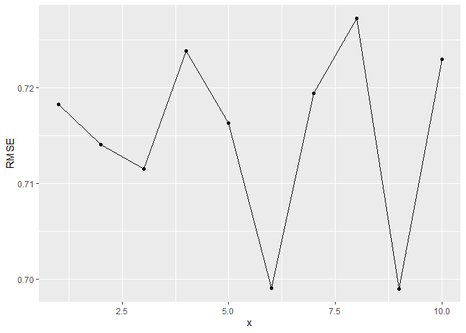<!-- -->

``` r
rf_best <- tune::select_best(rf_tune_grid,'rmse')
rf_best
```

    ## # A tibble: 1 × 4
    ##    mtry trees min_n .config              
    ##   <int> <int> <int> <chr>                
    ## 1     2   723    21 Preprocessor1_Model09

``` r
## finalizando e realizando as predições

rf_wf <- rf_wf |> tune::finalize_workflow(rf_best)

rf_last_fit <- tune::last_fit(rf_wf, rf_initial_split)

xco2_test <- bind_rows(
  tune::collect_predictions(rf_last_fit) |> 
    dplyr::mutate(modelo='rf')
)

## vendo importancia de cada feature

rf_last_fit_mod <- rf_last_fit$.workflow[[1]]$fit$fit
vip::vip(rf_last_fit_mod)
```

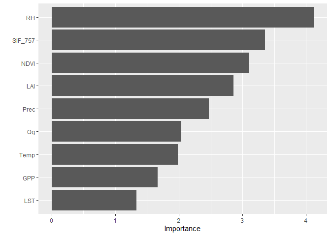<!-- -->

``` r
da <- xco2_test |> 
  dplyr::filter(XCO2adj>0, .pred>0)

rmse_rf <- Metrics::rmse(da$XCO2adj, da$.pred)
mape_rf <- Metrics::mape(da$XCO2adj, da$.pred)*100
```

``` r
xco2_test |> 
  ggplot2::ggplot(ggplot2::aes(y=.pred,x=XCO2adj))+
  ggplot2::geom_point()+
  ggplot2::geom_smooth(method = "lm")+
  ggpubr::stat_regline_equation(ggplot2::aes(
    label =  paste(..eq.label.., ..rr.label.., sep = "*plain(\",\")~~")),size=4)+
  ggplot2::annotate('text',x=390.5,y=391.6,label=paste0('RMSE = ',round(rmse_rf,4),', MAPE = '
                                                        ,round(mape_rf,4),'%'),size=4)+
  ggplot2::labs(x=expression(paste('Xco'[2][' obs']~'ppm')),
                y=expression(paste('Xco'[2][' est']~'ppm')))+
  ggplot2::theme_bw()+
  ggplot2::theme(axis.title= ggplot2::element_text(size=12),
                 axis.text = ggplot2::element_text(size=12,color='black'),
                 legend.text = ggplot2::element_text(size=12)
  )
```

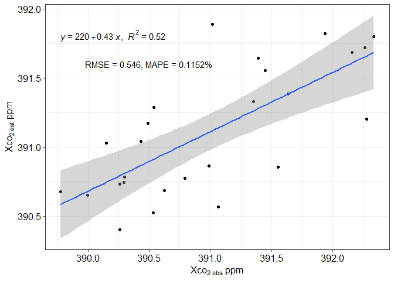<!-- -->

## **Tabelas para Krigagem**

``` r
for(i in 15:21){
  xco2_geo <- xco2_or |> 
    dplyr::select(lon, lat, ano, date,xco2_adj) |> 
    dplyr::mutate(
      lon=round(lon,2),
      lat=round(lat,2)
      ) |> 
    dplyr::filter(
      lubridate::year(date) == as.numeric(paste0(20,i))) |> 
    group_by(lon,lat) |> 
    summarise(xco2= mean(xco2_adj))
  
  write.csv(xco2_geo, paste0('data/xco2_geo_20',i,'.csv'))
  
}
```

``` r
for(i in 15:21){
  sif_geo <- sif_or |> 
    dplyr::select(lon, lat, ano, date,sif_757) |> 
    dplyr::mutate(
      lon=round(lon,2),
      lat=round(lat,2)
      ) |> 
    dplyr::filter(
      lubridate::year(date) == as.numeric(paste0(20,i))) |> 
    group_by(lon,lat) |> 
    summarise(sif= mean(sif_757))
  
  write.csv(sif_geo, paste0('data/sif_geo_20',i,'.csv'))
  
}
```
